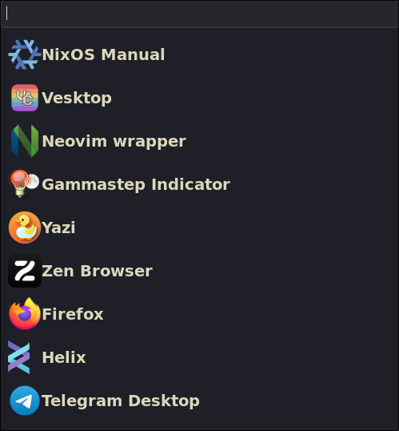

# AGS widgets for Hyprland {Kanagawa theme}

Some widgets are ~~horrendously stolen~~ inspired from the examples in the
[AGS repository](https://github.com/Aylur/ags/tree/main/example).

Also those widgets are powered by the [Kanagawa GTK Theme](https://github.com/Fausto-Korpsvart/Kanagawa-GKT-Theme).

Some honorable mentions:

1. Scratchpad (because it is a separate workspace) is not visible in widget for
your own sake.

2. Sound button displays volume in a tooltip and is scrollable
(it uses wireplumber underneath so keep it in mind). 

3. For scripts you need to use [Nushell](https://github.com/nushell/nushell) or
just write your own scripts if Nushell is not preferrable **(but give Nushell a
 try!)**.

4. No CSS preprocessor (skill issue).
